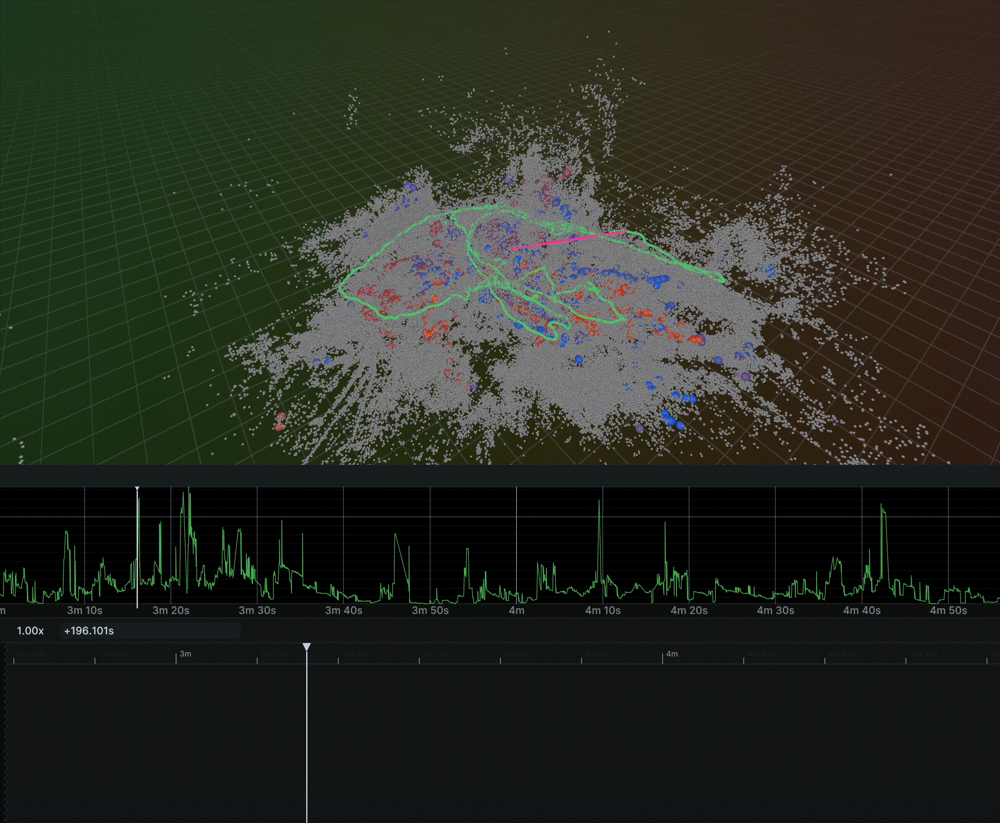
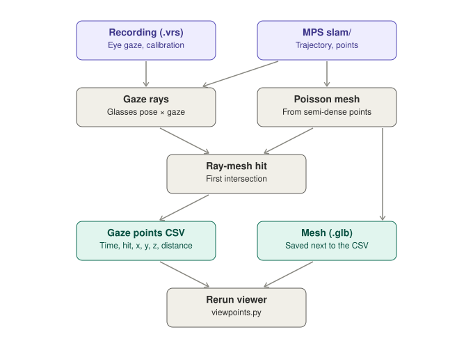

# AriaGazeCast
Raycast Eye Gaze using Aria Gen2 Glasses

<div align="center">
  
</div>

GazePoint finds where in 3D the wearer of Project Aria Gen 2 glasses was looking. It casts each eye-gaze sample from the .vrs recording onto a mesh built from the MPS SLAM semi-dense point cloud, then writes one CSV row per sample: <u>time</u>, <u>hit or miss</u>, and the <u>3D point</u>. The mesh is saved alongside it.

<div align="center">
  
</div>


## User Guide

You need **Python 3.10–3.12**.

```bash
git clone https://github.com/<your-account>/GazePoint.git
cd GazePoint
pip install -r requirements.txt
```

**2. Get MPS SLAM output** for your recording. Both scripts expect it in the same folder as the `.vrs`, named `mps_<recording>_vrs/`. `aria_mps` puts it there by default.

```text
aria/
├── Outside_20260812_141244.vrs
└── mps_Outside_20260812_141244_vrs/
    └── slam/
```

```bash
pip install projectaria-mps
aria_mps single -i "aria/Outside_20260812_141244.vrs" --features SLAM
```

**3. Find the gaze points.** Pass the `.vrs`. Two files are written next to it: `<recording>_gaze_points.csv`, and the mesh the rays were cast at, `<recording>_gaze_mesh.glb`.

```bash
python gazepoint.py "aria/Outside_20260812_141244.vrs"
```

| Column | Meaning |
| --- | --- |
| `tracking_timestamp_us` | Sample time on the glasses' clock, which MPS also uses |
| `hit` | `1` if the gaze hit the mesh. `0` for blinks, samples outside the trajectory, or gaze at nothing reconstructed |
| `x_m`, `y_m`, `z_m` | Gaze point in the MPS world frame, in metres, with Z up |
| `distance_m` | Distance from the eyes to the gaze point |

**4. View them.** This opens the Rerun viewer with the mesh, the glasses' path and the gaze points. Drag the timeline to follow the gaze. Keep the CSV, the mesh and the MPS folder together. The viewer stops with an error if the mesh is missing or unreadable.

```bash
python viewpoints.py "aria/Outside_20260812_141244_gaze_points.csv"
```

**5. Tune (optional).** These are the constants at the top of `gazepoint.py`.

| Constant | Default | Effect |
| --- | --- | --- |
| `INV_DIST_STD`, `DIST_STD` | `0.005`, `0.01` | Keep only confident semi-dense points |
| `RADIUS_M` | `50.0` | Drop points farther than this from the median point |
| `POISSON_DEPTH` | `10` | Mesh detail. The finest cell is about the scene size / 1024 |
| `TRIM_QUANTILE` | `0.05` | Remove this fraction of the least-supported mesh vertices |
| `MAX_POSE_GAP_US` | `1000` | Treat gaze with no pose within this gap as outside the trajectory |
